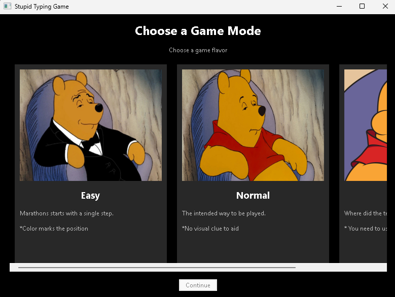

# Stupid Typing Game

 

## What is this?

Paste some text. Type it back **perfectly**.
There is no time limit. There is a counter, because apparently suffering needs to be measured.
Finish the text and you get:

> **X seconds**
> And some buttons. No fireworks. You typed some text. Congratulations.

## How it works

The game checks every character as you type.
Type the wrong character and:

* A sound plays.
* The screen scuffles.
* **All progress is erased.**
  Yes, all of it. One typo sends you back to the beginning. Correct characters are not saved. There is no partial correction. There is no mercy.
  The game then waits for you to try again, presumably having learned something.

## The objective

> **Type the entire text without making a single mistake.**
> That's it.

## Requirements

* **Python 3.13**
* **wxPython**
* **Pygame**

```bash
pip install wx
pip install pygame
```
