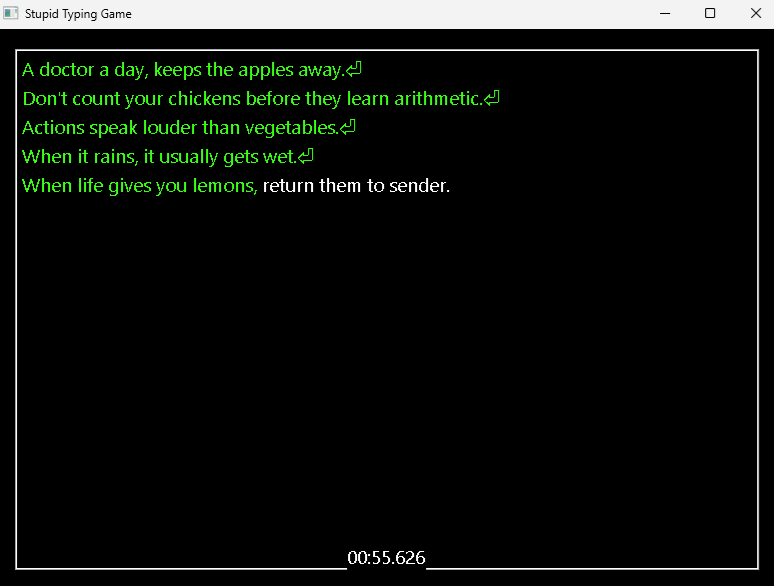

# Stupid Typing Game




## What is this?

It starts with some text pasted into the clipboard.

The user copies something, pastes it into **Stupid Typing Game**, and then has one job:

> **Type the entire thing perfectly.**

There is no time limit.

There is, however, a counter, because apparently suffering needs to be measured.

Once the entire text has been entered correctly, the game displays a very simple result:

> **X seconds**

And a couple of buttons.

That's it.

No celebration. No fireworks. You typed some text. It took X seconds.

Congratulations.

---

## How it works

For every character typed, the game checks whether the correct character was entered.

For example, if the text says:

> *"An apple a day keeps the doctor away."*

and the user types `A`, the game checks whether `A` is the expected character.

Then it checks the next one.

And the next one...

This continues until the entire text has been entered, or the user rage quits.

Whether this is done by checking the key that was pressed or the character actually inserted into the field is irrelevant, as long as we use whichever method is less CPU-expensive.

The game does not need to perform advanced computational research to determine whether someone typed an `A`.

### And then you make a mistake.

If a character is entered incorrectly, a simple sound effect plays and the screen scuffles.

Then the interesting part happens.

**All progress is erased.**

The user starts again from the beginning.

There is no partial correction.

No keeping the correctly typed portion.

No mercy.

One wrong character means the entire attempt is discarded.

---

## The objective

The objective is therefore extremely simple:

> **Type the entire pasted text correctly without making a single mistake.**

That's it.

This is the whole thing.

Pretty simple.

---

## Requirements

* **Python 3.13**
* **wxPython**
* **Pygame**

Install the dependencies with:

```bash
pip install wx
pip install pygame
```
